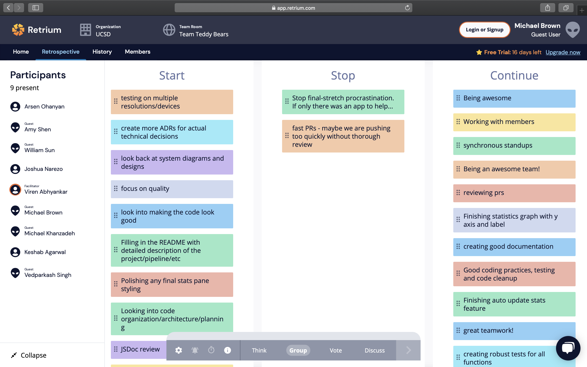
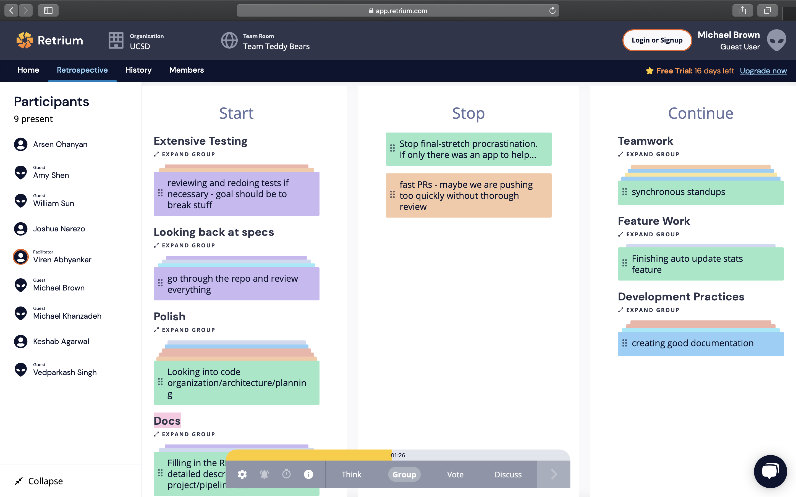
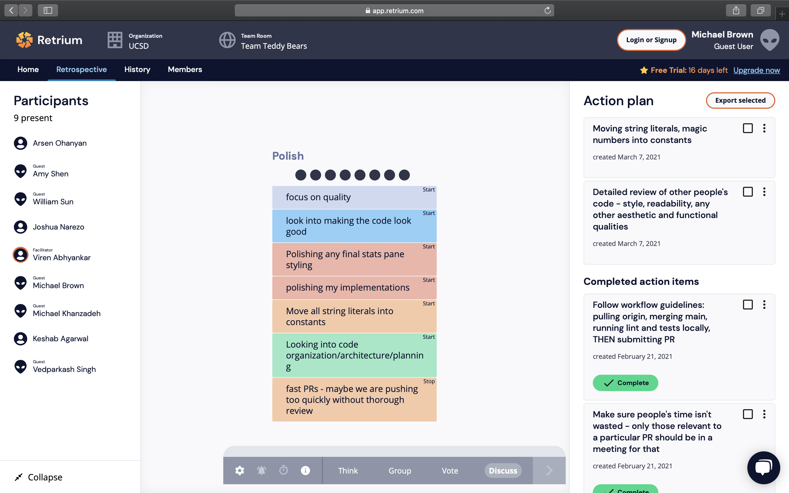

```
- Team: Teddy Bears
- Date: 3/7/21
- Time: 9:25pm (Sunday)
- Duration: 35 min.
- Location: Zoom (Online)
- Written by: Michael Brown
- Attendance: 9/9
```

With the final stretch of development in sight, our team has reconvened once more to reflect upon our past achievements and remaining areas of improvement. The images and action plans (as shown below) were documented from a live Retrium session. Keep note that these discussions took place after a 15 minute standup overview of weeks 8 and 9.

-------

# Retrium - Start, Stop, Continue

### Anonymous Thoughts:


### Organized Reflections:


### Cycling Through:


*Side notes*
- We want to be as attentative as possible with our final implementations 
  - Fast PRs may cause last-minute collisions and impede our progress
- Functional quality before visual quality
  - Albeit most features already installed, working incrementally is key
- Meeting adjustment for Tuesday (3/9/21): "Bug bashing!"
  - Try to break each other's code to find remaining errors
- Overall: consistent effort across Week 8 with greater improvement throughout Week 9!

-------

# Responsive Action Plans

[Link to Action Items](./RetroNotes-Part2/Retrospective2.csv)

### Additional Notes for Remaining Items
- *Moving string literals into constants*
  - If JS file for constants becoming too big, can consider creating a separate Strings file/folder
  - For handling "internationalization" of passed variables across all files
-------
- *Detailed reviews of each other's PRs and code*
  - Careful and consistent reviews from all members
  - To prevent any last-minute collisions
-------
- *JSDocs*
  - Function headers/variable declarations must be reviewed to meet documentation standards
-------
- *READMEs*
  - Write out detailed project pipeline and installation instructions
  - Implmement links to our JSDocs
-------
- *ADRs*
  - Each sub-group should create one for choices made / features built
    - Example: document the decision process for designing the stats graph
  - Use early ADRs written by Viren, Arsen, and Amy as references for formatting
