- Team: Teddy Bears
- Date: 3/7/21
- Time: 9:00pm (Sunday)
- Duration: 40 min.
- Location: Zoom (Online)
- Written by: Michael Brown
- Attendance: 9/9

-------

# A Brief Introduction

After the conclusion of Sprint 2, our team had successfully developed an MVP (Minimum Viable Product). The skeleton code of our HTML, CSS, and JS files were established and  populated with functional components. These implementations included a functioning timer, start/stop button, animated UI, and more. Our project's steady progression was heavily influenced by the ways in which we organized ourselves into sub-groups to tackle specific challenges. This success was also attributed by everyone's timely dedication (whether in-person via Zoom or asynchronously across Slack and GitHub).

This level of effort continued into Weeks 8 and 9 for our third Sprint of the quarter. With the MVP out of the way, much of our focus was dedicated to the extensive reorganization and overall improvement of our code. Our previous PRs had left some bugs that were inevitably squashed while testing became more prevelant across future implementations. These improvements created a safer foundation for our members to develop more advanced features. Our sub-groups from Sprint 2 were kept the same to maintain our members' familiarity with the components they had created.

The sections below entails the unique contributions of our members as well as the groups they worked with.

-------

# Team Contributions

### Statistics
- Contributors: **Joshua Narezo, Michael Khanzadeh, Vedparkash Singh**

As our team transitioned from Sprint 2, a majority of our MVP's front-end was already complete. However, our statistics pane was still a blank slate, needing to be populated with important user data. For this sprint, Joshua, Michael K., and Vedparkash continued their collective effort to extract information from our back-end and display it on our app's interface. Each of the members cross-pollinated their efforts between each other, but most importantly focused on a unique component for the stats pane.

Michael K. was able to develop several functions in JS to calculate user statistics (ie. total time spent focusing and average distractions per pomo). Other functions simply retrieved from localStorage (such as Amy's implementation of the pomo counter) and even the timer's text display itself. The toughest of these functions were those that formatted the graphical chart in which Michael prepared formulas for axis scaling and other modifications for visual cleanliness.

In congruence to implementations, Joshua led a series of Figma designs for the team to collaborate from scratch and simplify their vision. Joshua's planning allowed everyone to clarify important key aspects such as the graph's axes, behavior, organization, and more prior to their programming. In addition, Joshua then experimented with functions in pixel scaling to find solutions that would make the UI scaling more consistent across different resolution monitors.

As these functions were completed incrementally, Vedparkash connected the group's JS files to our team's HTML. In addition to setting up the back-end for extraction, Ved returned to the front-end to finalize any remaining animations and visual components from Week 8 of our sprint. Due to the scope of the statistics pane, Vedparkash then delved into Cypress testing to expand the team's coverage over all of their technical implementations.

- *Snapshot of dynamic stats pane w/ graphical interface*

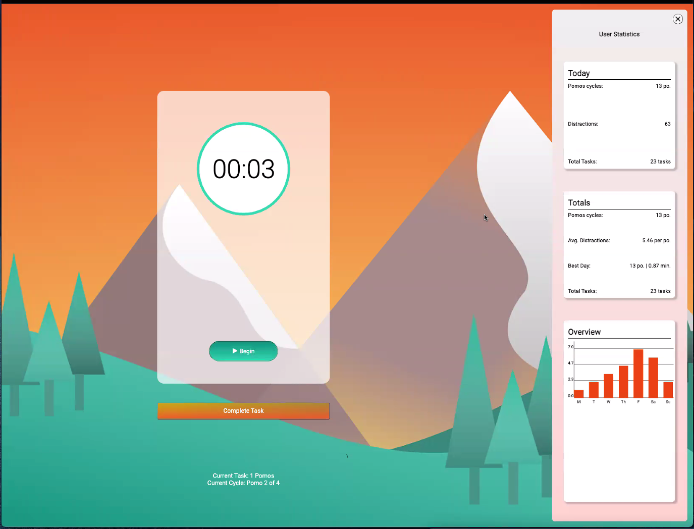

- *Additional snapshot of Figma drafts*

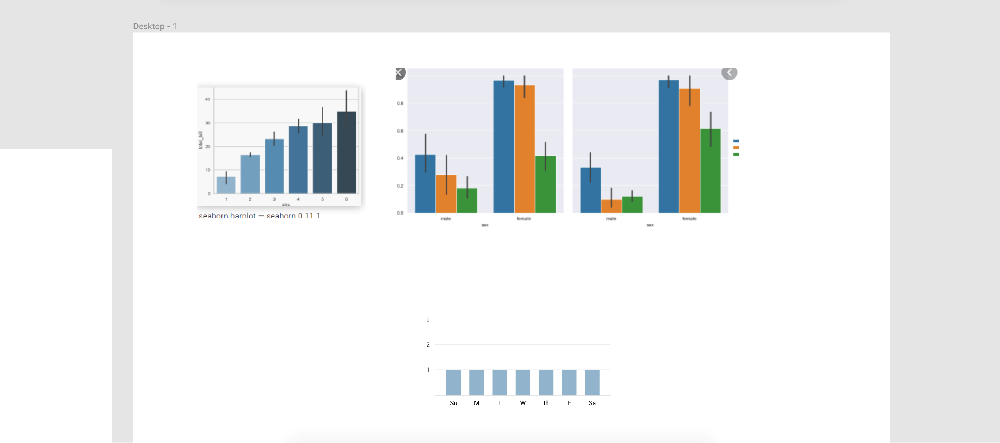

- *Glimpse of reorganized code*

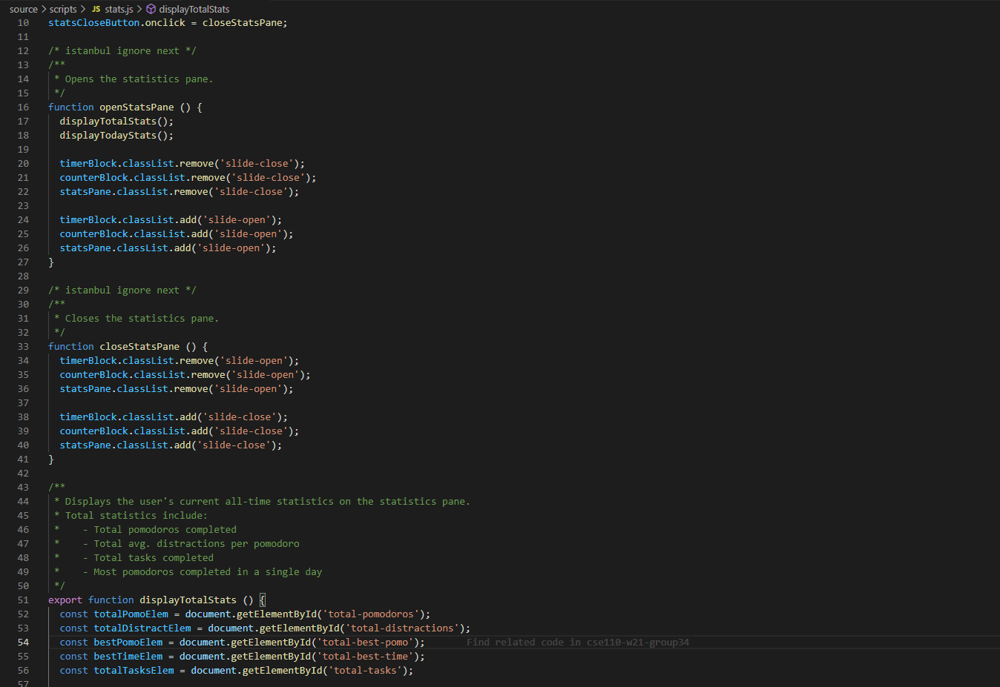

-------

### Pomodoro Counter + localStorage
- Contributor: **Amy Shen**

It's without a doubt that our stats display depends on specific data to read from and calculate. Hence, Amy's work was crucial as her implementations provided a pomodoro counter that tracks user behavior. This feature was first augmented to the timer team's earliest iteration of "beginCountdown", a function that updates the visual timer live depending on user input. Behind the scenes, this function utilizes a variable that tracks the current stages of a pomo cycle to verify when a long or short break should be entered. Amy's feature traces this information and feeds it into localStorage for the functions by our stats team to retrieve.

In addition, this information is displayed on-screen and below the start/stop button (below is a GIF that demonstrates this). There are two unique trackers: the first displays the number of work periods passed until the user presses "Complete Task" whereas the second displays the current stage of the entire pomo cycle. The first counter resets by user input and the second resets once the user finishes their extended break (after 4 work periods).

As the timer team remodeled their code and created newer PRs, Amy was quick to assess any sudden bugs and glitches that would appear in the counters. Her immediate fixtures helped solidify our code and allowed our team to progress more confidently towards future stretch stories.

- *Live example (take note that timer settings are shortened for the sake of showcasing)*

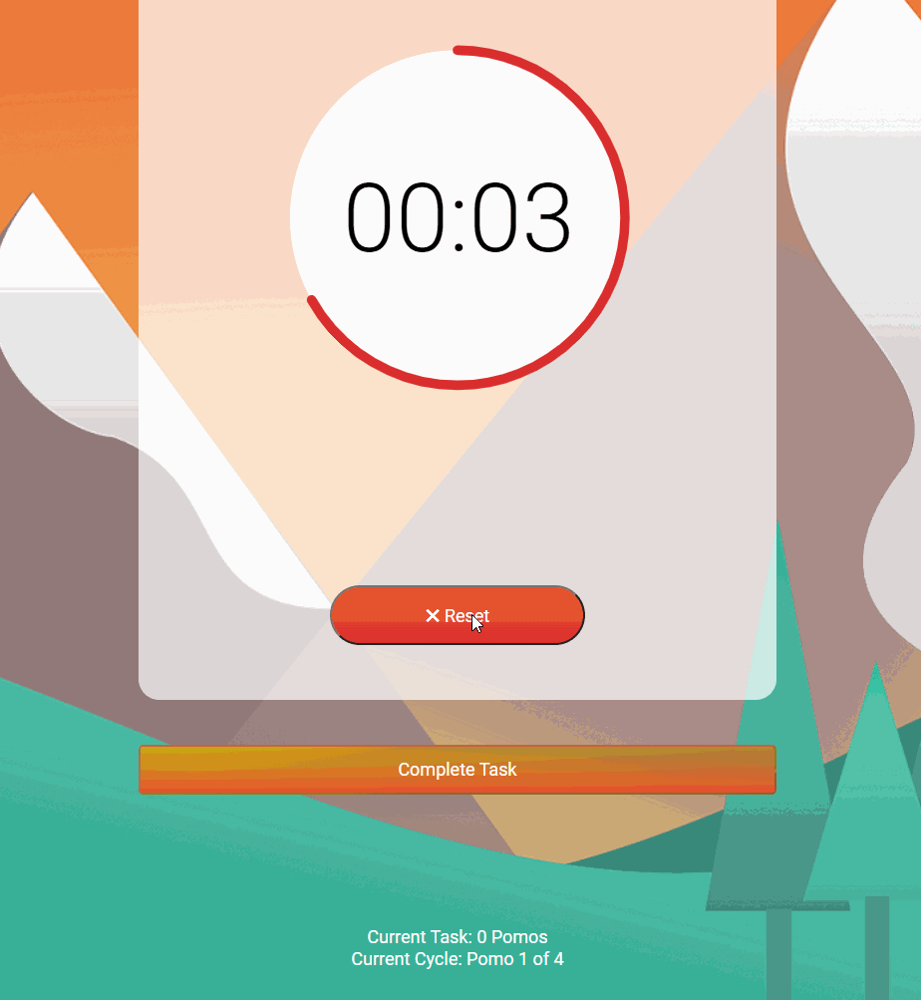

- *Glimpse of implementation*

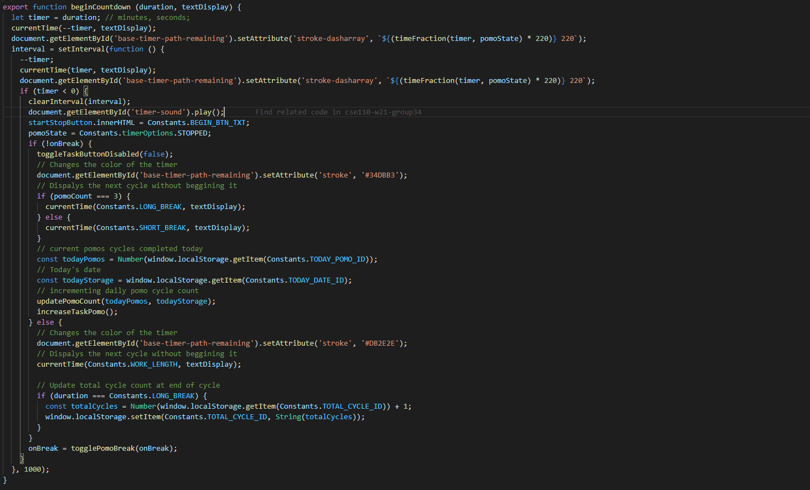

-------

### Task Button
- Contributors: **Viren Abhyankar, William Sun**

Similarly to the experiences of other teams, Viren and William began Sprint 3 by reexploring their previous code to consider what needed to be reorganized or simplified. Given that the work of multiple groups was beginning to intertwine, the pair collaborated to break apart our local storage functions into granular subjects for improved usability. In addition, any sudden or prevalent bugs (such as the start/reset button accidentally resetting an entire pomo cycle) were fixed instantly.

As for the button itself, it remained crucial that every piece of our final app would be as user-friendly as possible. Given that the user is expected to primarily interact with the start/stop button, Viren and William decided to expand its capabilities in JS. A visual aid was devloped to appear on-screen whenever a user would choose to click and reset the pomo cycle. Our entire team originally believed that a single "Reset" text prompt was too vague and that the user could accidentally break their progress. Hence, this feature was a necessity. In addition, we were concerned that a user would accidentally reset their break cycle; this action would contradict the point of having a break in teh first place. To resolve this, Viren and William enhanced the button with a disable feature to stop its event listener and even grayed out the box for a more distinct appearance. Lastly, the two overviewed their code in Cypress via extensive testing to ensure that no other bugs remained.

- *Example of button appearance during a break cycle*

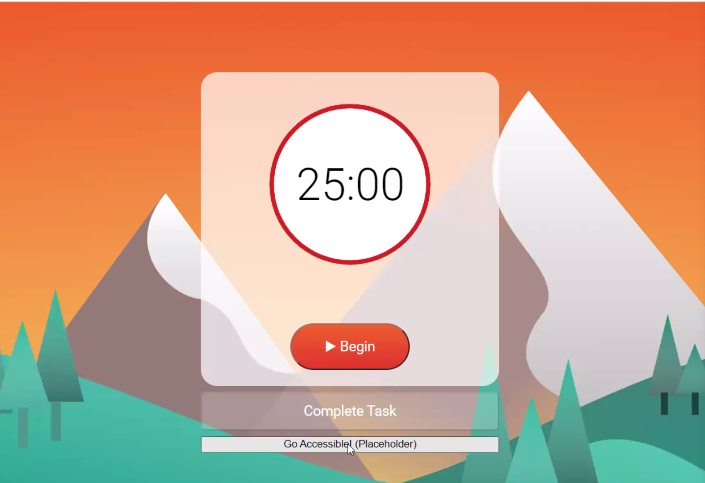

- *Glimpse of Cypress testing implementations*

-------

### Timer
- Contributors: **Keshab Agarwal, Michael Brown**

Due to a high number of PRs at the end of Sprint 2, a collision in our code was seemingly inevitable. Thankfully, the timer team responded quickly and resolved a UI glitch in the center of our clock due to a mistakenly deleted portion of CSS code. In addition to this and other design tweaks, Michael B. and Keshab collaborated to resolve several more bugs. These optimizations resided in our JS files, such as updating the interval of our timer countdown function to respond to user input immediatly rather than via 1-second intervals. Another improvement involved simplifying the timer JS functionality from two separate functions (a timer and break counter) into a single function with proper conditionals.

Following Arsen's introduction of Cypress testing to the group project, Michael and Keshab created a new file to increase code coverage. This testing file overlooked the functionality of our start/stop button, proper text display, pomo cycle tracker, and more.

Near the end of the sprint, the Timer Team engaged with new stretch goal features as some of the images below entail a WIP settings pane. Michael utilized the HTML and CSS code written by the statistics team (Joshua, Vedparkash, Michael K.) to clone a left-hand page whereas Keshab's goal will be to help populate its inner panes.

- *Glimpse of written Cypress testing:*

- *Early WIP build of left pane:*

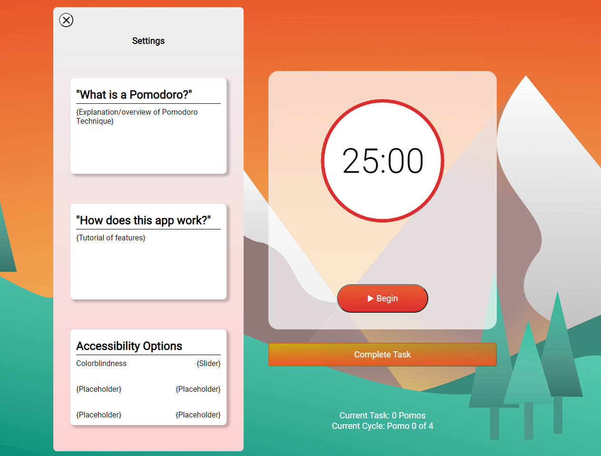

-------

### Code Cleanup + Accessibility
- Contributor: **Arsen Ohanyan**

As a technical project grows, so too does its level of complexity. Arsen took upon the challenge to delve into our MVP from Sprint 2 and reorganize our work before the rest of our teams commenced. This rehaul took place in our JS code as most of our original implementations were within a single file. Arsen thus divided our work into separate files based on our sub-groups (ie. startResetButton.js, stats.js, and taskButton.js). Additionally, a JS file called constants.js was implemented to divide "read-only" constants from "writable" variables. This action was necessary to "internationalize" our variable usage across all other files to enable easier access, readability, and testing.

Arsen then created a lint action for our GitHub repository. Whenever a team would create a PR for our main branch, linting would run to check for and flag any bugs or stylistic errors. This was especially necessary for encouraging our team members' writing styles to "normalize" over time so that individuals could review each other's code more clearly.

As we neared the end of this sprint, Arsen focused on accessibility stretch goals. Colorblindness and keystroke accessibility, as of now, stand as the two current features that are being implemmented. An image below features a snapshot of this WIP.

- *Glimpse of code-cleanup*

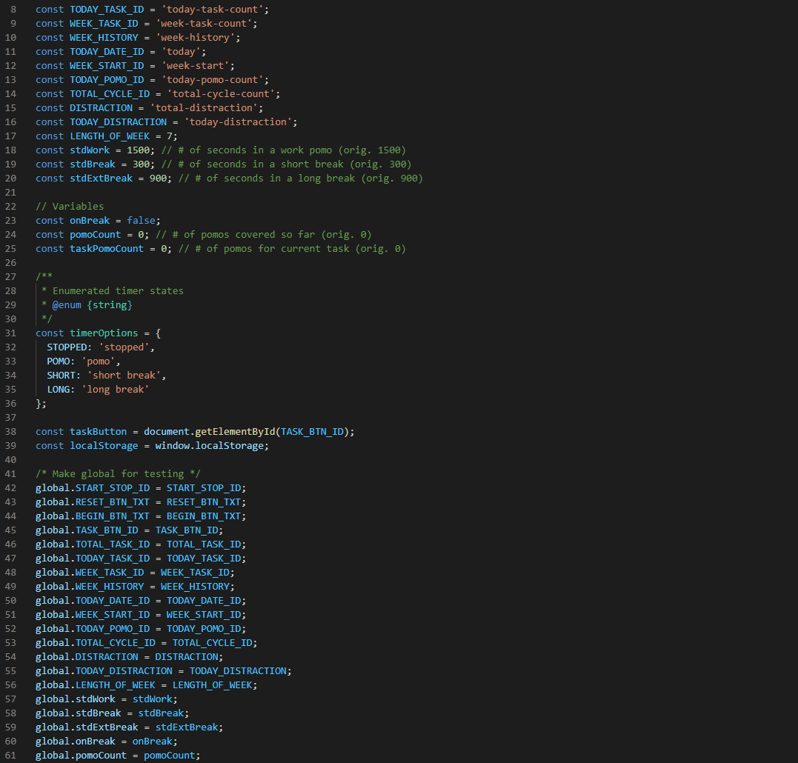

- *Example of visual tweak for accessibility:*

Original Appearance        |  Color Brightness/Modification
:-------------------------:|:-------------------------:
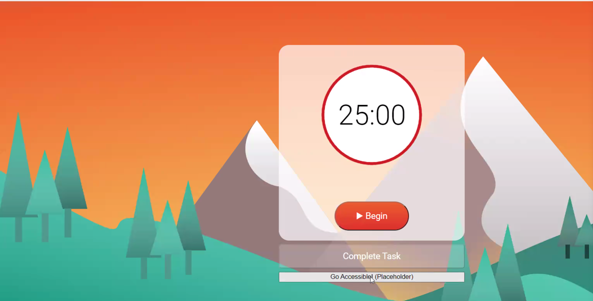  |  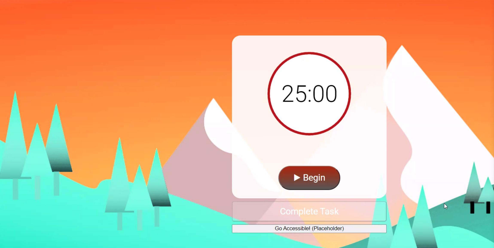

-------

# Demo Overview (w/ Sprint 2 MVP Comparison)
- Take note that the timer durations in the first example was shortened for simplified demonstration.

## Before:
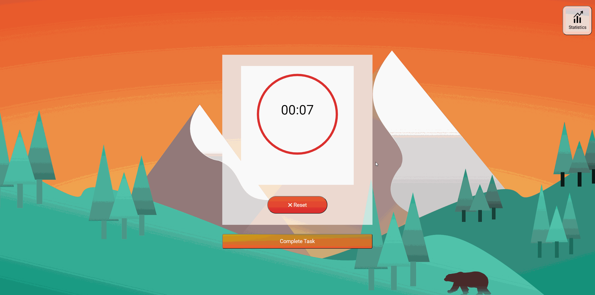

## After:

-------

# Overall

Our team has made an impressive amount of progress so far. As of now, we are continuing our efforts to optimize our code and clean up the details of our UI. Meanwhile, some of us are prepping to integrate new stretch goal features. However, the scale of these improvements will depend upon the appropriate time that remains once all of our required implementations are written, tested, and merged.
