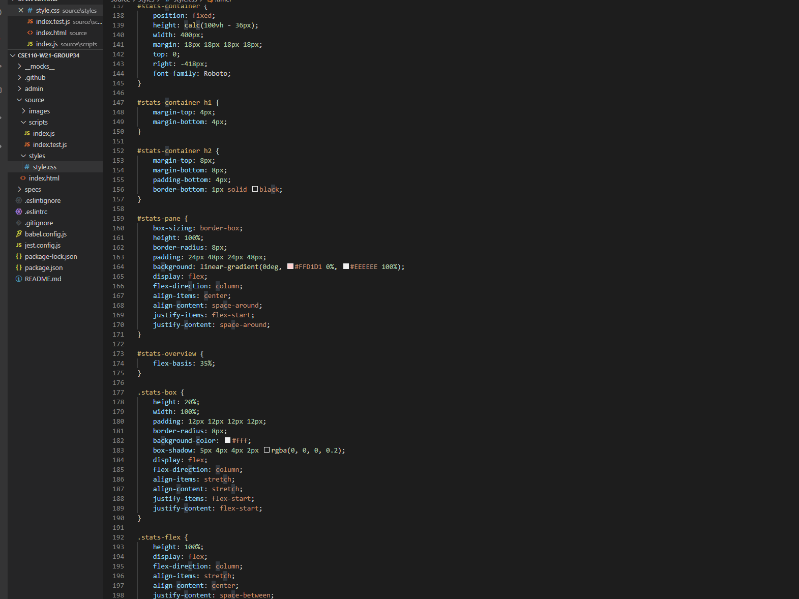
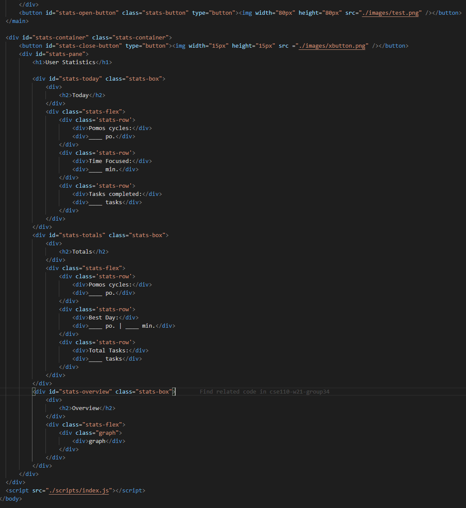
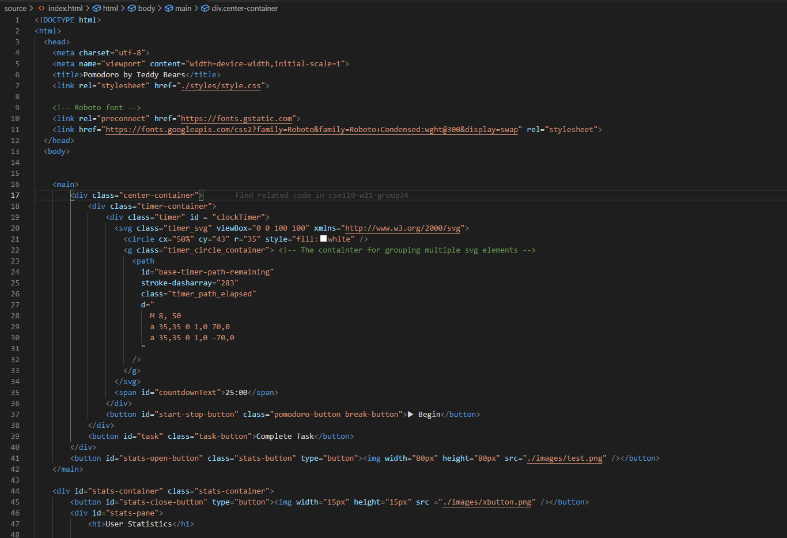
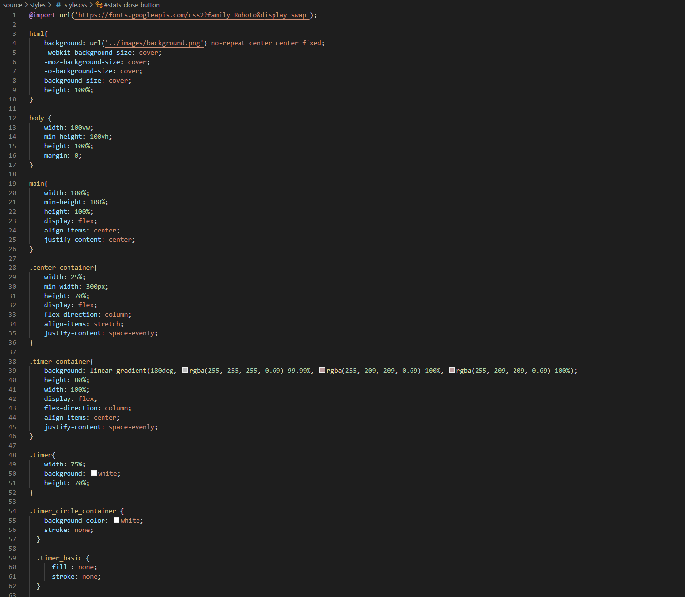
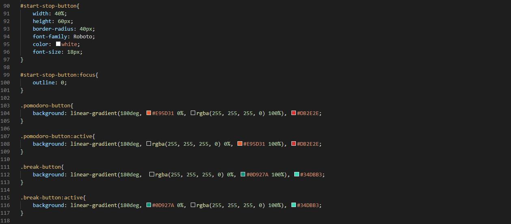
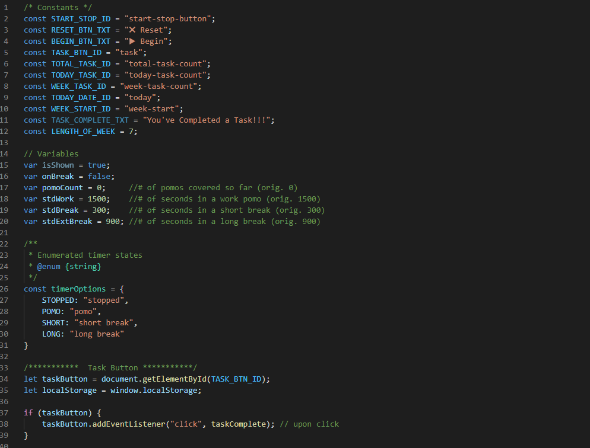

- Topic: Code Merging & Hindsight Overview
- Date: 2/18/21
- Time: 11:00am (Sunday)
- Location: Zoom (Online)
- Written by: Michael Brown
- Attendance: 9/9
- Time: 1 hr. 30 min.

## PRs and Merging
```
- All members collaborated live on VS Code

- Start timer testing was fixed
  * Additional updates/tweaks in visuals will carry into Sprint 3 tasks
  * ie. finalizations in ring color transitions + fade effects

- William's code merged afterward
 * Task button functionality

- After-thoughts
 * Code is becoming quite hefty; need to make more modular
 * ie. linting, commenting, splitting code into individual, appropriate files

- Overall coverage:
  * Dropped to sub 60%
  * Aiming for >75% by end of week/sprint
```

## Closing Coverage of JS code

File      | % Stmts | % Branch | % Funcs | % Lines | Uncovered Line #s
----------|---------|----------|---------|---------|----------------------------
All files |   61.47 |    47.06 |   61.54 |   61.47 | 
 index.js |   61.47 |    47.06 |   61.54 |   61.47 | 37-40,61-82,96-118,247-258

NOTE (as of 2/20/21):
- Testing improvements over the following weekend has resulted in coverage of 89%!

----------

# Overview of Contributions

In hindsight of our work and accomplishments throughout Sprint 2, our team has been able to successfully construct an MVP for our Pomodoro app. With that in mind, there awaits a larger set of tasks that our group will divide and conquer in the coming weeks ahead. As for now, we will delve further into what each member/sub-group achieved as well as how their contributions influenced the overall design of our project.


### Statistics
- Contributors: **Joshua Narezo, Michael Khanzadeh, Vedparkash Singh**

This group was tasked with producing the essential functionality of our statistics page of the web application. The majority of this work comprised of front-end development, such as the page's opening/closing animations and button event listeners. The HTML implementation was kept simplistic in design as the information we wish to display is intended to appear in a vertical fashion. Hence, several containers (divs) were utilized to help organize the text and make the necessary stylization as concise/simple as possible. The animation and appearance of the page was then implemented as a majority of the group's code was written in CSS. Lastly, two panel buttons were implemented via onclick listeners in JS to allow the user to open/close the stats display. Open and close functions were also written to implement the visual transition cues.

Before the end of the sprint, the group moved further into the back-end design phase. This early brainstorming phase was necessary to solidify how our program would retrieve information and store data with persistence. Luckily, William's implementations with the app's task button as well as back-end JS functions were prepared for the stats team to refer to for additional guidance. 

*Examples of developed code:*





----------

### Task Button
- Contributor: **William Sun**

The task button, alone, is extremely pivotal when it comes to documenting and tracking our users' habits as they use the pomo app. Since this data is meant to be further manipulated by our stats team, this implementation alone must act as a clear foundation for others to use. Hence, William was able to write a series of JS local storage functions as well as prepare several storage variables to allow data tracking across daily and weekly user performances.

This code is organized into unique cases (thanks to clear commenting) that describe how specific circumstances will impact how our data is calculated. In addition, William's code reads the timer output (produced by the timer team) and reformats it for easier input to be tossed between functions.

*Example of developed code:*


---------

### Timer
- Contributors: **Keshab Agarwal, Michael Brown**

The next section in our list of contributions describes the timer functionality itself. The webpage's skeleton was created prior to the actions of this group so that it would serve as a helpful guide for future code implementations. The majority of work for the timer was then divided into two tasks: ring animation and timer feed.

Keshab handled the CSS framework for designing the timer's ring and color animation. Its shape and color were defined in CSS and later implemented in JS. The animation of the ring is fluid (as in, its FPS does not snap) and is synched to the clock by reading in the total number of seconds and returning a fraction to measure the time remaining. On the other hand, Michael focused on producing the timer's interval and text display. The necessity for CSS was minimalistic whereas the code written for JS required implementations of interval functions to update the feed for each second passed.

The team then merged its code locally with a copy of the start/stop button functionality. This process allowed the timer and ring to be paired so that the code would initiated/concluded based on user input.

*Example of developed code:*


--------

### Skeleton Page
- Contributors: **Arsen Ohanyan, Amy Shen**

This team was tasked with constructing the pure foundation of our application by setting up the early principle layout of our HTML and CSS files. The organization of divs in HTML were labeled for other teams to navigate through and insert their code for future merges. Most importantly, the code structure was written based on the submitted UI design from the previous sprint. This was especially prevalent for the CSS as the background, image layout, and fonts had replicated exactly what our final Figma drafts appeared as.

*Example of developed code:*






### Start / Stop Button
- Contributor: **Viren Abhyankar**

In order to allow user interaction and enable functionality, Viren implemented the start/stop buttton. The button was formatted in HTML and CSS with a majority of its implementation involved in JS. Viren's work introduced a global variable that would track the state of the pomodoro cycle (ie. notifying if the timer is stopped, ongoing, or in the midst of a break). This information is then used/passed through the timer to track which duration should be shown. The implementation toggles between such states and displays the appropriate text on the button for the user.

*Examples of developed code:*





----------

Altogether, each of the sub-groups were able to produce their work on a timely fashion. Groups with more than one person were able to hold as many syncrhonous meetings as necessary. Asychnronous work was held between all members via Slack so that future merges and concerns would be clearer.

In addition, all groups (where necessary) contributed to a JS test file to increase the coverage of our project.

# MVP (as of Sprint 2)
- Below is a quick demo of our current MVP. Take note that the timer durations are shortened on purposefor easier demonstration.


